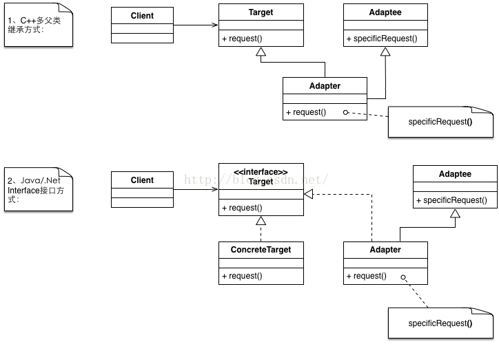

# Adapter Pattern（适配器模式）

* 将一个类的接口转换成另外一个客户希望的接口。Adapter 模式使得原本由于接口不兼容而不能一起工作的那些类可以一起工作。
注：适配器模式在详细设计阶段不需要考虑它，它是为了对现有系统或产品接口兼容时，也就是既成事实的情况下的补救措施。

## 适用性

* 你想使用一个已经存在的类，而它的接口不符合你的需求。
* 你想创建一个可以复用的类，该类可以与其他不相关的类或不可预见的类（即那些接口可能不一定兼容的类）协同工作。
* （仅适用于对象Adapter）你想使用一些已经存在的子类，但是不可能对每一个都进行子类化以匹配它们的接口。对象适配器可以适配它的父类接口。

## 结构

 
## 模式组成

| 组成（角色） | 作用 |
| --- | --- |
| Target (目标角色，要用的接口)  | 定义Client使用的与特定领域相关的接口。  |
| Client (使用场景)  | 与符合Target接口的对象协同。  |
| Adaptee (被适配者)  | 定义一个已经存在的接口,这个接口需要适配。  |
| Adapter (适配器，把Adaptee接口转换为Target可用的接口)  | 对Adaptee的接口与Target接口进行适配  |
