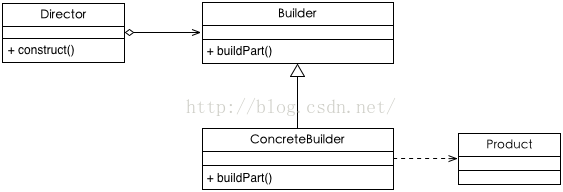

# Builder Pattern（建造者模式）

* 将一个复杂对象的构建与它的表示分离，使得同样的构建过程可以创建不同的表示

## 使用场景

* 相同的方法，不同的执行顺序，产生不同的事件结果时；
* 多个部件或零件，都可以装配到一个对象中，但是产生的运行结果又不相同时；
* 产品类非常复杂，或者产品类中的调用顺序不同产生了不同的效能，这个时候使用建造者模式非常合适；

## UML类图


 
## 角色介绍

| 组成（角色） | 作用 |
| --- | --- |
| Builder(抽象建造者角色)  | 为创建一个Product对象的各个部件指定抽象接口 |
| ConcreteBuilder(具体建造者) | 具体的构建器  |
| Director(导演角色) | 统一组装过程(可省略)  |
| Product(建造的产品) | 表示被构造的复杂对象。 ConcreteBuilder创建该产品的内部表示并定义它的装配过程 <br/> 包含定义组成部件的类,包括将这些部件装配成最终产品的接口。 |

## 代码

```
class Computer private constructor() {
    private var cpu: String? = null
    private var mainBoard: String? = null

    class Builder {
        private val computer = Computer()

        fun setCpu(cpu: String): Builder {
            computer.cpu = cpu
            return this
        }

        fun setMainBoard(mainBoard: String): Builder {
            computer.mainBoard = mainBoard
            return this
        }

        fun build(): Computer {
            return computer
        }
    }

    fun show() {
        println("$TAG cpu=$cpu mainBoard=$mainBoard")
    }

    companion object {
        private const val TAG = "Computer"
    }
}
```

## android源码中的模式实现 

* AlertDialog.Builder

## 优点与缺点

### 优点

* 良好的封装性， 使用建造者模式可以使客户端不必知道产品内部组成的细节；
* 建造者独立，容易扩展；
* 在对象创建过程中会使用到系统中的一些其它对象，这些对象在产品对象的创建过程中不易得到。

### 缺点

* 会产生多余的Builder对象以及Director对象，消耗内存；
* 对象的构建过程暴露。

## [更多](https://github.com/simple-android-framework/android_design_patterns_analysis/tree/master/builder/mr.simple)