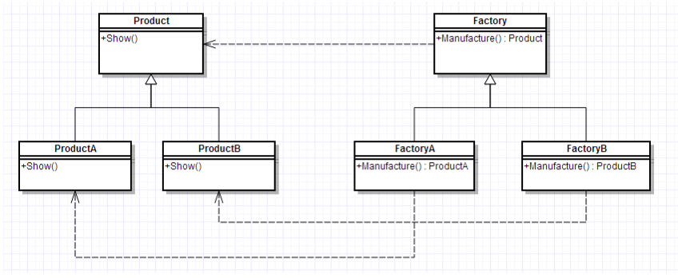

# Factory Method Pattern（工厂方法模式）

* 工厂方法模式，又称工厂模式、多态工厂模式和虚拟构造器模式，通过定义工厂父类负责定义创建对象的公共接口，而子类则负责生成具体的对象。

## 主要作用

* 将类的实例化（具体产品的创建）延迟到工厂类的子类（具体工厂）中完成，即由子类来决定应该实例化（创建）哪一个类。

## UML类图


 
## 模式组成

| 组成（角色） | 关系 | 作用 |
| --- | --- | --- |
| 抽象产品（Product） | 具体产品的父类 | 描述具体产品的公共接口 |
| 具体产品（Concrete Product） | 抽象产品的子类；工厂类创建的目标类 | 描述生产的具体产品 |
| 抽象工厂（Creator） | 具体工厂的父类 | 描述具体工厂的公共接口 |
| 具体工厂（Concrete Creator） | 抽象工厂的子类；被外界调用 | 描述具体工厂；实现FactoryMethod工厂方法创建产品的实例 |

## 代码
```
interface Product {
    fun show()
}

class ProductA : Product {
    companion object {
        private const val TAG = "ProductA"
    }

    override fun show() {
        println("$TAG show")
    }
}

class ProductB : Product {
    companion object {
        private const val TAG = "ProductB"
    }

    override fun show() {
        println("$TAG show")
    }
}

interface Factory {
    fun create(): Product
}

object FactoryA : Factory {
    override fun create(): Product {
        return ProductA()
    }
}

object FactoryB : Factory {
    override fun create(): Product {
        return ProductB()
    }
}

fun factoryDemo() {
    FactoryA.create().show()
    FactoryB.create().show()
}
```