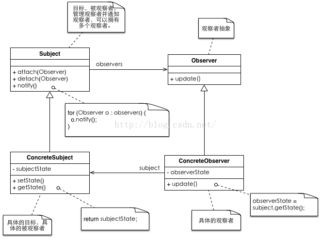

# Observer Pattern（观察者模式）

* 定义对象间的一种一对多的依赖关系,当一个对象的状态发生改变时, 所有依赖于它的对象都得到通知并被自动更新。

## 适用性

* 当一个抽象模型有两个方面, 其中一个方面依赖于另一方面。将这二者封装在独立的对象中以使它们可以各自独立地改变和复用。
* 当对一个对象的改变需要同时改变其它对象, 而不知道具体有多少对象有待改变。
* 当一个对象必须通知其它对象，而它又不能假定其它对象是谁。换言之，你不希望这些对象是紧密耦合的。

## 结构

 
## 模式组成

| 组成（角色） | 作用 |
| --- | --- |
| Subject(目标)  | 目标知道它的观察者。可以有任意多个观察者观察同一个目标。    提供注册和删除观察者对象的接口。  为那些在目标发生改变时需获得通知的对象定义一个更新接口 |
| ConcreteSubject(具体目标)  | 将有关状态存入各ConcreteObserver对象。  当它的状态发生改变时 , 向它的各个观察者发出通知。 |
| ConcreteObserver(具体观察者)  | 维护一个指向ConcreteSubject对象的引用。  存储有关状态,这些状态应与目标的状态保持一致。  实现Observer的更新接口以使自身状态与目标的状态保持一致。  |
