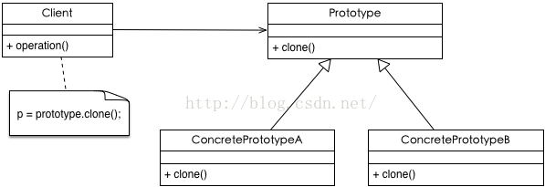

# Prototype Pattern（原型模式）

* 用原型实例指定创建对象的种类，并且通过拷贝这些原型创建新的对象

## 适用性

* 类初始化需要消化非常多的资源，这个资源包括数据、硬件资源等，通过原型拷贝避免这些消耗；
* 通过 new 产生一个对象需要非常繁琐的数据准备或访问权限，则可以使用原型模式；
* 一个对象需要提供给其他对象访问，而且各个调用者可能都需要修改其值时，可以考虑使用原型模式拷贝多个对象供调用者使用，即保护性拷贝。

## 结构


 
## 模式组成

| 组成（角色） | 作用 |
| --- | --- |
| Prototype(原型) | 声明一个克隆自身的接口 |
| ConcretePrototype(具体的原型) | 实现一个克隆自身的操作 |
| Client(场景) | 让一个原型克隆自身从而创建一个新的对象 |

## 代码
```
interface Product {
    var desc:String
    fun show()
    fun copy(): Product
}

class RealProduct : Product, Cloneable {
    override var desc: String = ""

    override fun show() {
        println(desc)
    }

    override fun copy(): Product {
        val p = super.clone() as Product
        p.desc = desc
        return p
    }
}

fun prototypeDemo() {
    val product1 = RealProduct()
    product1.desc = "this is product1"
    product1.show()

    val product2 = product1.copy()
    product2.desc = "this is product2"
    product2.show()
}
```

## android源码中的模式实现

```
Uri uri = Uri.parse("smsto:0800000123");    
Intent shareIntent = new Intent(Intent.ACTION_SENDTO, uri);    
shareIntent.putExtra("sms_body", "The SMS text");    

Intent intent = (Intent)shareIntent.clone() ;
startActivity(intent);
```

## 优点与缺点

### 优点

* 原型模式是在内存二进制流的拷贝，要比直接 new 一个对象性能好很多，特别是要在一个循环体内产生大量的对象时，原型模式可以更好地体现其优点。

### 缺点

* 这既是它的优点也是缺点，直接在内存中拷贝，构造函数是不会执行的，在实际开发当中应该注意这个潜在的问题。优点就是减少了约束，缺点也是减少了约束，需要大家在实际应用时考虑。

## [更多](https://github.com/simple-android-framework/android_design_patterns_analysis/tree/master/prototype/mr.simple)