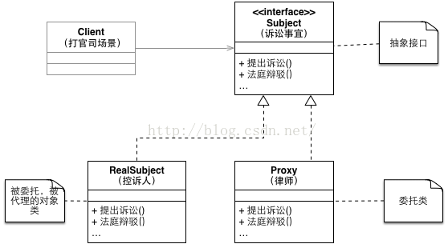

# Proxy Pattern（代理模式）

* 为其他对象提供一种代理以控制对这个对象的访问。

## 适用性

* 在需要用比较通用和复杂的对象指针代替简单的指针的时候，使用Proxy模式

## 结构

 
## 优缺点

* 职责清晰

真实的角色就是实现实际的业务逻辑，不用关心其他非本职责的事务，通过后期的代理完成一件完成事务，附带的结果就是编程简洁清晰。
* 代理对象可以在客户端和目标对象之间起到中介的作用，这样起到了中介的作用和保护了目标对象的作用。
* 高扩展性。
