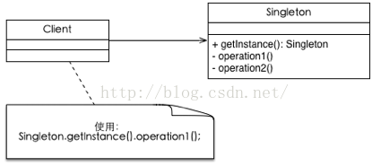

# Singleton Pattern（单例模式）

* 该模式需要确保该类只能生成一个对象，通常是该类需要消耗太多的资源或者没有没有多个实例的理由。例如一个公司只有一个CEO、一台电脑通常只有一个显示器等。下面我们以公司里的CEO为例来简单演示一下，一个公司可以有几个VP，无数个员工，但是CEO只有一个

## 使用场景

* 确保某个类有且只有一个对象的场景，例如创建一个对象需要消耗的资源过多，如要访问 IO 和数据库等资源。

## UML类图



## 代码

```
class MySingleton private constructor(){
    companion object {
        private const val TAG = "MySingleton"

        private var instance : MySingleton? = null
            get() {
                if (field == null) {
                    synchronized(this) {
                        if (field == null)
                            field = MySingleton()
                    }
                }
                return field
            }

        fun get(): MySingleton {
            return instance!!
        }
    }

    fun foo() {
        println("$TAG foo")
    }
}

fun singletonDemo() {
    MySingleton.get().foo()
}
```

## android源码中的模式实现 

```
itemView = LayoutInflater.from(mContext).inflate(mLayoutId, null);
```

## 优点与缺点

### 优点

* 由于单例模式在内存中只有一个实例，减少了内存开支，特别是一个对象需要频繁地创建、销毁时。
* 由于单例模式只生成一个实例，所以减少了系统的性能开销，当一个对象的产生需要比较多的资源时，如读取配置、产生其他依赖对象时，则可以通过在应用启动时直接产生一个单例对象，然后用永久驻留内存的方式来解决；
* 单例模式可以避免对资源的多重占用，例如一个写文件动作，由于只有一个实例存在内存中，避免对同一个资源文件的同时写操作。
* 单例模式可以在系统设置全局的访问点，优化和共享资源访问，例如可以设计一个单例类，负责所有数据表的映射处理。

### 缺点

* 单例模式一般没有接口，扩展很困难，若要扩展，除了修改代码基本上没有第二种途径可以实现。

## [更多](https://github.com/simple-android-framework/android_design_patterns_analysis/tree/master/singleton/mr.simple)